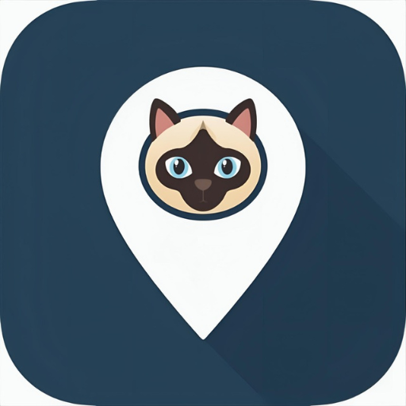
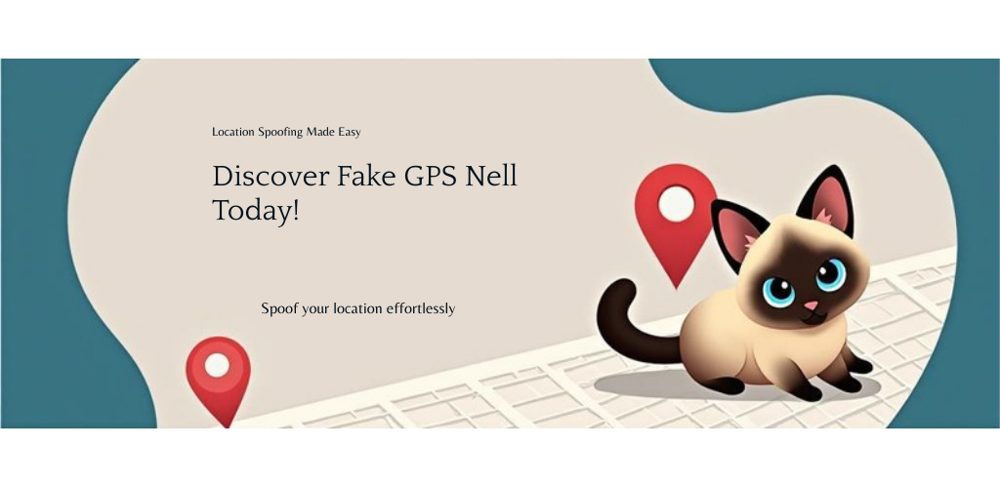

# 🐱 Fake GPS Nell

  

**Simulá tu ubicación GPS con la ayuda de Nell, una gata siamesa de 19 años.**

> Fake GPS Nell te permite cambiar tu ubicación GPS en Android. Teletransportate al instante o simulá un viaje real por ruta con velocidad configurable.

  

---

## 📍 Funciones principales

### Teletransporte instantáneo
Tocá cualquier punto del mapa y movete ahí al instante. También podés buscar direcciones o ingresar coordenadas manualmente.

### Simulación de viaje por ruta (Pro)
Simulá un viaje real siguiendo calles y rutas reales gracias a OSRM. Elegí tu velocidad: caminando, ciudad o ruta.

### Joystick flotante (Pro)
Movete libremente por el mapa en tiempo real con un joystick flotante superpuesto sobre cualquier app.

### Búsqueda de direcciones
Buscá cualquier dirección del mundo con geocodificación integrada (Nominatim/OpenStreetMap).

### Favoritos (Pro)
Guardá tus ubicaciones frecuentes para acceder rápidamente.

### Historial de sesiones (Pro)
Revisá todas tus sesiones anteriores con fecha, duración y ubicación.

### Programación automática (Pro)
Configurá horarios para que la ubicación falsa se active automáticamente.

### Importar/Exportar GPX (Pro)
Importá y exportá rutas en formato GPX para compartir o reutilizar.

### Widget de pantalla de inicio
Activá o desactivá la ubicación falsa directamente desde tu pantalla de inicio.

---

## 🆓 Versión gratuita vs ⭐ Pro

| Función | Gratis | Pro |
|---------|--------|-----|
| Teletransporte | ✅ | ✅ |
| Búsqueda de direcciones | ✅ | ✅ |
| Coordenadas manuales | ✅ | ✅ |
| Mapa interactivo | ✅ | ✅ |
| Widget de inicio | ✅ | ✅ |
| Sesiones por día | 3 | Ilimitadas |
| Duración por sesión | 30 min | Ilimitada |
| Simulación de viaje | ❌ | ✅ |
| Joystick flotante | ❌ | ✅ |
| Favoritos | ❌ | ✅ |
| Historial | ❌ | ✅ |
| Programación automática | ❌ | ✅ |
| GPX import/export | ❌ | ✅ |
| Auto-stop | ❌ | ✅ |

**Pro:** $4.99 USD — compra única, para siempre.

---

## 🔒 Privacidad

- **No recopilamos datos personales**
- Todo se almacena localmente en tu dispositivo
- Sin rastreo, sin anuncios, sin terceros
- Internet solo para búsqueda de direcciones y cálculo de rutas

📄 [Política de Privacidad completa](PRIVACY_POLICY.md)

---

## ⚠️ Requisitos

- Android 7.0 o superior
- Activar **"Ubicaciones simuladas"** en Opciones de desarrollador
- Seleccionar **Fake GPS Nell** como app de ubicación simulada

### ¿Cómo activar ubicaciones simuladas?

1. Ir a **Ajustes > Acerca del teléfono**
2. Tocar **Número de compilación** 7 veces para activar opciones de desarrollador
3. Ir a **Ajustes > Opciones de desarrollador**
4. Activar **Seleccionar app de ubicación simulada**
5. Seleccionar **Fake GPS Nell**

---

## 💬 Feedback

¡Tu opinión nos importa! Si tenés sugerencias, bugs o ideas:

- **Reportar un bug:** [Abrir issue](https://github.com/gabriel600r/fake-gps-nell-feedback/issues/new?labels=bug&template=bug_report.md)
- **Sugerir una función:** [Abrir issue](https://github.com/gabriel600r/fake-gps-nell-feedback/issues/new?labels=enhancement&template=feature_request.md)
- **Preguntas generales:** [Abrir issue](https://github.com/gabriel600r/fake-gps-nell-feedback/issues/new)

---

## 🐱 Sobre Nell

Nell es una gata siamesa de 19 años que supervisa todo el desarrollo de esta app. Su espíritu aventurero inspiró una app que te permite estar en cualquier parte del mundo... sin moverte del sillón.

---

*Hecho con 💙 por [EgeaINC](https://github.com/gabriel600r) y supervisado por Nell 🐱*
