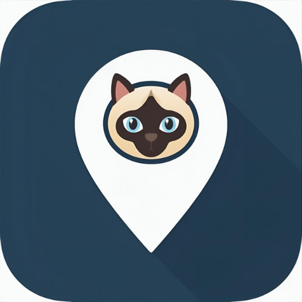
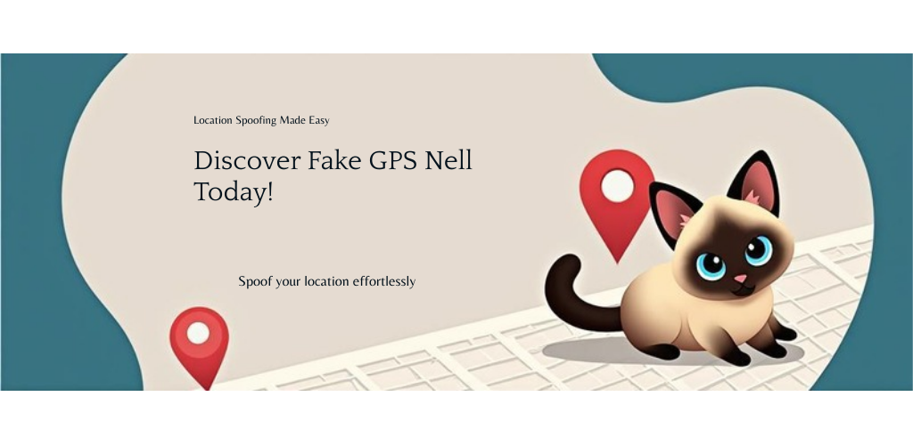

# 🐱 Fake GPS Nell

  

**Simulá tu ubicación GPS con la ayuda de Nell, una gata siamesa de 19 años.**

> Fake GPS Nell te permite cambiar tu ubicación GPS en Android. Teletransportate al instante o simulá un viaje real por ruta con velocidad configurable.

📲 **[Descargala gratis en Google Play](https://play.google.com/store/apps/details?id=com.egeainc.fakegpsnell)**

  

---

## 📍 Gratis

- **Teletransporte instantáneo** a cualquier punto del mapa, con búsqueda de direcciones (Nominatim/OpenStreetMap) o coordenadas manuales.
- **Simulación de viaje** por calles y rutas reales (OSRM): caminando, en bici o en auto, a la velocidad que quieras.
- **Joystick flotante** para moverte en tiempo real.
- **Historial** de sesiones con fecha, duración y lugar.
- **Auto-stop:** se apaga solo a la hora que elijas.
- **Exportar rutas GPX** y compartir favoritos en CSV.
- **Hasta 5 favoritos**, con carpetas y colores.
- **Widget** de pantalla de inicio y modo oscuro.
- **Sin límite** de sesiones ni de tiempo.

## ⭐ Fake GPS Nell PRO (pago único)

| | Gratis | PRO |
|---|---|---|
| Teletransporte, búsqueda, coordenadas | ✅ | ✅ |
| Simulación de viaje | ✅ | ✅ |
| Joystick | ✅ | ✅ |
| Historial y auto-stop | ✅ | ✅ |
| Sesiones | Sin límite | Sin límite |
| Favoritos | Hasta 5 | Ilimitados |
| Programar (perfiles por horario) | 🔒 | ✅ |
| Modo Loop ∞ (ida y vuelta automático) | 🔒 | ✅ |
| Anuncios | Uno chico arriba del mapa | Ninguno |

El anuncio de la versión gratis nunca aparece cerca del botón de iniciar ni sobre el joystick.

---

## 🔒 Privacidad

- Tus favoritos, tu historial y las ubicaciones que simulás quedan en tu teléfono.
- Los anuncios son de Google AdMob, que usa el ID de publicidad del dispositivo. Con PRO no se cargan.
- En la Unión Europea, el Reino Unido y Suiza la app pide tu consentimiento antes de mostrar anuncios personalizados.

📄 [Política de Privacidad completa](PRIVACY_POLICY.md) · 📝 [Novedades](CHANGELOG.md) · 🇺🇸 [English](README-en.md)

---

## ⚠️ Requisitos

- Android 7.0 o superior
- La app está en español e inglés
- Activar **"Ubicaciones simuladas"** en Opciones de desarrollador
- Seleccionar **Fake GPS Nell** como app de ubicación simulada

### ¿Cómo activar ubicaciones simuladas?

1. Ir a **Ajustes > Acerca del teléfono**
2. Tocar **Número de compilación** 7 veces para activar opciones de desarrollador
3. Ir a **Ajustes > Opciones de desarrollador**
4. Activar **Seleccionar app de ubicación simulada**
5. Seleccionar **Fake GPS Nell**

---

## 💬 Feedback

¡Tu opinión nos importa! Si tenés sugerencias, bugs o ideas:

- **Reportar un bug:** [Abrir issue](https://github.com/gabriel600r/fake-gps-nell-feedback/issues/new?labels=bug&template=bug_report.md)
- **Sugerir una función:** [Abrir issue](https://github.com/gabriel600r/fake-gps-nell-feedback/issues/new?labels=enhancement&template=feature_request.md)
- **Preguntas generales:** [Abrir issue](https://github.com/gabriel600r/fake-gps-nell-feedback/issues/new)

---

## 🐱 Sobre Nell

Nell es una gata siamesa de 19 años que supervisa todo el desarrollo de esta app. Su espíritu aventurero inspiró una app que te permite estar en cualquier parte del mundo... sin moverte del sillón.

---

*Hecho con 💙 por [EgeaINC](https://github.com/gabriel600r) y supervisado por Nell 🐱*
